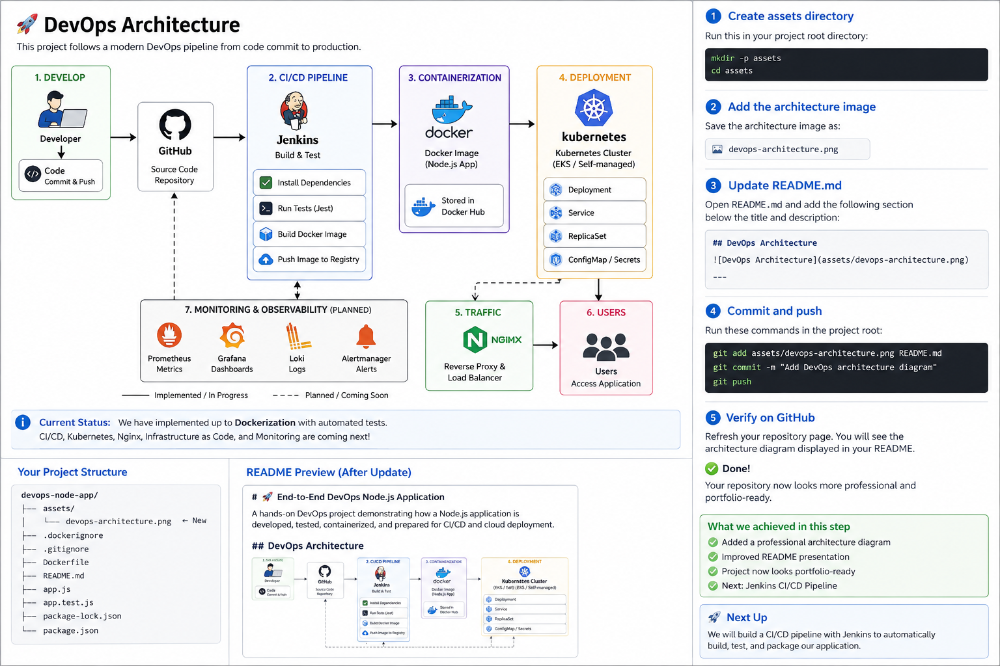

# 🚀 End-to-End DevOps Node.js Application

A hands-on DevOps project demonstrating how a Node.js application is developed, tested, containerized, and prepared for CI/CD and cloud deployment.

## 👨‍💻 Project Owner

**fareez-lic**

## 📋 Project Overview

This project demonstrates an end-to-end DevOps workflow using a Node.js and Express application.

The project will progressively introduce:

- Application development
- Automated testing
- Docker containerization
- Jenkins CI/CD
- Kubernetes deployment
- Nginx
- Terraform infrastructure
- Cloud deployment
- Monitoring and observability

## 🏗️ DevOps Architecture



## 🛠️ Technology Stack

| Technology | Purpose |
|---|---|
| Node.js | Application runtime |
| Express.js | Web application framework |
| Jest | Automated testing |
| Supertest | API testing |
| Docker | Containerization |
| Jenkins | CI/CD automation |
| Kubernetes | Container orchestration |
| Nginx | Reverse proxy |
| Terraform | Infrastructure as Code |

## 📁 Project Structure

```text
devops-node-app/
├── .dockerignore
├── Dockerfile
├── app.js
├── app.test.js
├── package.json
├── package-lock.json
└── README.md
```

## 🌐 Application Endpoints

| Endpoint | Method | Purpose |
|---|---|---|
| `/` | GET | Application welcome/status |
| `/health` | GET | Application health check |
| `/about` | GET | Project and technology information |

---

# 🟢 Application Development

The application was developed using Node.js and Express.js.

The main application file is:

```text
app.js
```

The application runs on port:

```text
3000
```

Start the application locally with:

```bash
node app.js
```

Expected output:

```text
App running on port 3000
```

## Testing the Application Locally

Test the main endpoint:

```bash
curl http://localhost:3000
```

Test the health endpoint:

```bash
curl http://localhost:3000/health
```

Test the project information endpoint:

```bash
curl http://localhost:3000/about
```

For formatted JSON output, `jq` can be used:

```bash
curl http://localhost:3000 | jq
```

Example response:

```json
{
  "message": "🚀 DevOps Node App is Live!",
  "version": "1.0.0",
  "author": "fareez-lic",
  "status": "running"
}
```

---

# 🧪 Automated Testing

Jest and Supertest were added to test the Express application.

Run the test suite with:

```bash
npm test
```

The test suite verifies:

- `GET /` returns HTTP 200
- `GET /health` returns a healthy status
- `GET /about` returns project information

The test suite completed successfully:

```text
Test Suites: 1 passed, 1 total
Tests:       3 passed, 3 total
```

This provides a basic automated testing foundation for the CI/CD pipeline that will be added later.

---

# 🐳 Docker Containerization

The application was containerized using Docker.

The Docker image is based on:

```text
node:18-alpine
```

## Dockerfile

The final Dockerfile contains:

```dockerfile
FROM node:18-alpine

RUN apk add --no-cache curl

WORKDIR /app

COPY package*.json ./

RUN npm install --production

COPY . .

EXPOSE 3000

HEALTHCHECK --interval=30s --timeout=3s \
  CMD curl -f http://localhost:3000/health || exit 1

CMD ["node", "app.js"]
```

## Dockerfile Explanation

### Base Image

```dockerfile
FROM node:18-alpine
```

Uses a lightweight Alpine-based Node.js image.

### Install curl

```dockerfile
RUN apk add --no-cache curl
```

Installs `curl` inside the container.

This is required because the Docker health check uses `curl`.

### Working Directory

```dockerfile
WORKDIR /app
```

Sets `/app` as the working directory inside the container.

### Copy package files

```dockerfile
COPY package*.json ./
```

Copies `package.json` and `package-lock.json`.

### Install production dependencies

```dockerfile
RUN npm install --production
```

Installs the application's production dependencies.

### Copy application files

```dockerfile
COPY . .
```

Copies the project files into the image, excluding files listed in `.dockerignore`.

### Expose application port

```dockerfile
EXPOSE 3000
```

Documents that the application listens on port 3000.

### Docker Health Check

```dockerfile
HEALTHCHECK --interval=30s --timeout=3s \
  CMD curl -f http://localhost:3000/health || exit 1
```

Docker periodically calls the application's `/health` endpoint.

If the command succeeds, the container can be reported as healthy.

### Start the application

```dockerfile
CMD ["node", "app.js"]
```

Starts the Node.js application when the container runs.

---

# 🚫 .dockerignore

A `.dockerignore` file was created to prevent unnecessary files from being included in the Docker build context.

Current exclusions include:

```text
node_modules
npm-debug.log
.git
.env
*.test.js
.gitignore
README.md
```

This helps keep the Docker build context cleaner and prevents development-only files from being copied into the production image.

---

# 🏗️ Building the Docker Image

The Docker image was built with:

```bash
docker build -t devops-node-app .
```

The resulting image is:

```text
devops-node-app:latest
```

The Docker image was successfully built and tagged.

---

# ▶️ Running the Docker Container

The container was started with:

```bash
docker run -p 3000:3000 \
  --name devops-node-app-container \
  devops-node-app
```

The port mapping is:

```text
Host port 3000
       ↓
Container port 3000
```

The application starts with:

```text
App running on port 3000
```

---

# 🔍 Docker Health Check Troubleshooting

During the Docker implementation, the container initially reported:

```text
Up ... (unhealthy)
```

However, the application itself was responding correctly.

The `/health` endpoint worked from the host:

```bash
curl http://localhost:3000/health
```

and returned a healthy response.

## Investigation

The Docker container health information was inspected with:

```bash
docker inspect \
  --format='{{json .State.Health}}' \
  devops-node-app-container | jq
```

The health-check log showed:

```text
/bin/sh: curl: not found
```

## Root Cause

The Dockerfile contained a health check using:

```bash
curl -f http://localhost:3000/health
```

However, the `node:18-alpine` image did not have `curl` installed.

The host machine had `curl`, but the Docker container is an isolated environment with its own installed packages.

Therefore:

```text
Application health       ✅
Docker health check      ❌
```

## Fix

The following line was added to the Dockerfile:

```dockerfile
RUN apk add --no-cache curl
```

Because Alpine Linux uses the `apk` package manager, this installs `curl` inside the container.

---

# 🔄 Rebuilding After the Fix

After updating the Dockerfile, the Docker image was rebuilt:

```bash
docker build -t devops-node-app .
```

The rebuilt image successfully included `curl`.

The old container was stopped:

```bash
docker stop devops-node-app-container
```

The old container was removed:

```bash
docker rm devops-node-app-container
```

A new container was created from the rebuilt image:

```bash
docker run -p 3000:3000 \
  --name devops-node-app-container \
  devops-node-app
```

---

# ✅ Final Docker Validation

Docker was checked with:

```bash
docker ps
```

The final result showed:

```text
Up ... (healthy)
```

The container was also correctly mapped to:

```text
0.0.0.0:3000->3000/tcp
```

## Final Health Check

The application health endpoint returned:

```json
{
  "status": "healthy",
  "uptime": "...",
  "timestamp": "..."
}
```

Docker therefore successfully recognized the container as:

```text
healthy
```

---

# 🔗 Application Flow

```text
User / Browser
      |
      | HTTP :3000
      v
Ubuntu Host
      |
      | Port 3000:3000
      v
Docker Container
      |
      +-- Node.js
      +-- Express
      +-- curl
      |
      v
GET /health
      |
      v
Docker HEALTHCHECK
      |
      v
healthy
```

---

# 🧠 DevOps Troubleshooting Lesson

This project demonstrated a real-world troubleshooting workflow:

```text
Observe
   ↓
Investigate
   ↓
Find Root Cause
   ↓
Fix
   ↓
Rebuild
   ↓
Recreate
   ↓
Validate
   ↓
Document
```

The key lesson was:

> A healthy application does not automatically mean a healthy Docker container. The container's health-check command and its dependencies must also be available inside the container.

---

# 📊 Docker Verification Summary

| Check | Result |
|---|---|
| Docker installed | ✅ |
| Docker daemon running | ✅ |
| Docker image built | ✅ |
| Container created | ✅ |
| Application running | ✅ |
| Port 3000 exposed | ✅ |
| `/` endpoint | ✅ |
| `/health` endpoint | ✅ |
| `/about` endpoint | ✅ |
| Docker HEALTHCHECK | ✅ |
| Container status | ✅ Healthy |

---

# 🎯 Current Project Status

The project currently has:

- ✅ Node.js application
- ✅ Express.js API
- ✅ Jest tests
- ✅ Supertest API tests
- ✅ Dockerfile
- ✅ `.dockerignore`
- ✅ Docker image
- ✅ Docker container
- ✅ Docker HEALTHCHECK
- ✅ Healthy Docker container
- ⏳ Jenkins CI/CD
- ⏳ Kubernetes
- ⏳ Nginx
- ⏳ Terraform
- ⏳ Cloud deployment
- ⏳ Monitoring and observability

---

# 🚀 Next DevOps Goals

The project will continue to evolve through the following stages:

1. Git version control
2. GitHub repository
3. Jenkins CI/CD pipeline
4. Docker image publishing
5. Kubernetes deployment
6. Nginx reverse proxy
7. Terraform infrastructure as code
8. Cloud deployment
9. Monitoring and observability

The goal is to turn this initial Node.js application into a complete **end-to-end DevOps portfolio project**.

---

## 📌 Project Philosophy

This project is being built incrementally rather than simply copying a finished solution.

Each stage is:

```text
Build → Test → Troubleshoot → Fix → Validate → Document
```

This demonstrates practical DevOps skills and creates a reproducible project that can be showcased on GitHub.
