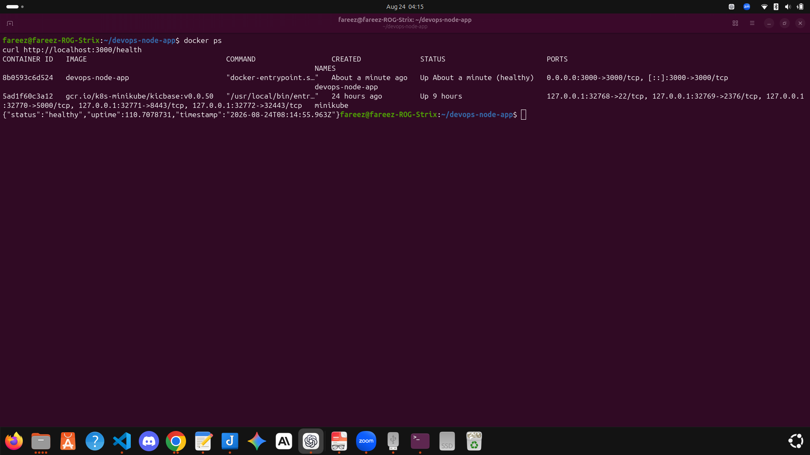
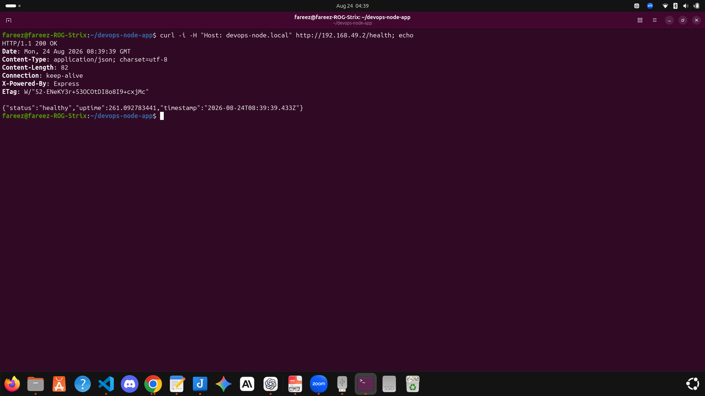
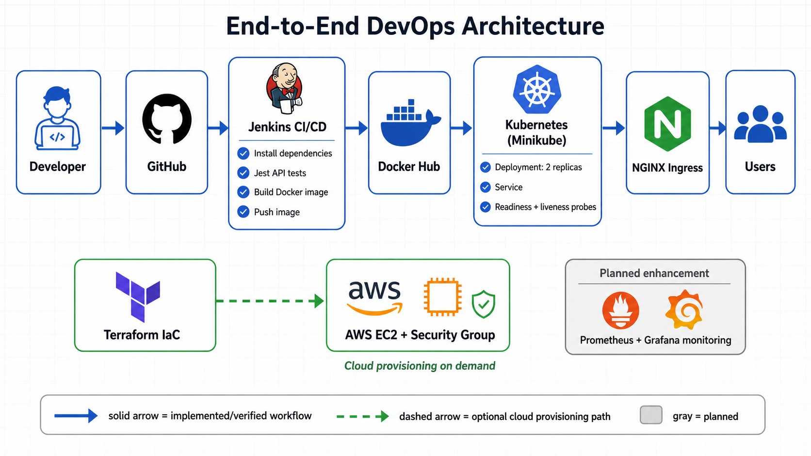
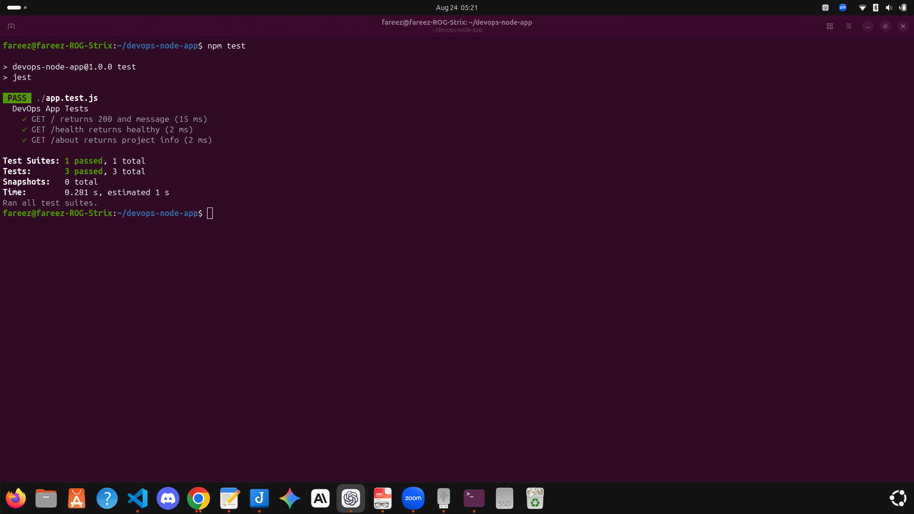
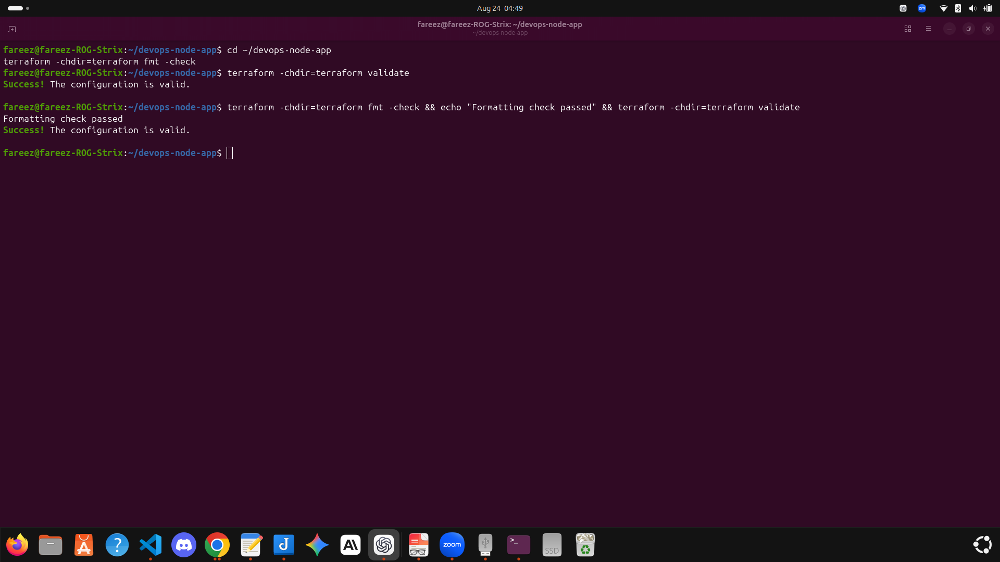

# 🚀 End-to-End DevOps Node.js Application

A complete DevOps portfolio project demonstrating the full lifecycle of
a Node.js application:

-   Application development
-   Automated testing
-   Docker containerization
-   Jenkins CI/CD automation
-   Docker Hub image publishing
-   Kubernetes deployment
-   Nginx Ingress routing
-   Terraform Infrastructure as Code
-   AWS EC2 cloud deployment

------------------------------------------------------------------------
## 📌 Project Status

### Implemented in this repository

- Node.js and Express application with automated Jest/Supertest API tests
- Docker build with a `/health` container health check
- Jenkins pipeline configuration for dependency installation, testing, Docker build, and Docker Hub push
- Kubernetes Deployment, Service, and Nginx Ingress manifests
- Terraform configuration for an AWS EC2 instance and security group

### Planned enhancement

- Monitoring and observability (for example, Prometheus and Grafana)


## 👨‍💻 Project Owner

**fareez-lic**

------------------------------------------------------------------------

# 🚀 Run Locally

```bash
npm install
npm start
```

The application starts at:

```text
http://localhost:3000/
```

Useful endpoints:

```text
/          # Application status
/health    # Health check
/about     # Project details
```

# 🐳 Run with Docker

Build the image:

```bash
docker build -t devops-node-app .
```

Run the container:

```bash
docker run -d --name devops-node-app -p 3000:3000 devops-node-app
```

Verify the health check:

```bash
curl http://localhost:3000/health
```

### Docker validation result



> **Build optimization:** Updating `.dockerignore` reduced the local Docker build context from **843.6 MB** to **207.4 kB**.


# 🔁 CI/CD Pipeline

The Jenkins pipeline is defined in `Jenkinsfile` and performs these stages:

1. Install Node.js dependencies with `npm install`
2. Run automated tests with `npm test`
3. Build the Docker image: `kam810/devops-node-app:latest`
4. Push the image to Docker Hub using Jenkins credentials

Docker Hub credentials are stored in Jenkins with the credential ID `dockerhub`; no password or token is stored in this repository.

The pipeline reports whether the build completed successfully or failed.

# ☸️ Kubernetes Deployment

The Kubernetes manifests deploy two application replicas, expose them through a Service, and route traffic with Nginx Ingress.

For a local Minikube cluster:

```bash
minikube addons enable ingress
kubectl apply -f k8s/
kubectl get pods,svc,ingress
```

The Ingress host is `devops-node.local`. Map it to your Minikube IP in your local hosts file before opening it in a browser.

```text
<MINIKUBE_IP> devops-node.local
```

Verify the application health endpoint:

```bash
curl http://devops-node.local/health
```

### Kubernetes Ingress validation result




# 🏗️ Architecture




The solid path represents the implemented and locally verified workflow. The dashed Terraform path represents optional AWS provisioning, while monitoring remains a planned enhancement.

``` text
Developer
   |
   v
GitHub Repository
   |
   v
Jenkins CI/CD Pipeline
   |
   +-------------------+----------------------+
   |                   |                      |
   v                   v                      v
Run Tests        Build Docker Image      Terraform
                       |                      |
                       v                      v
                  Docker Hub          AWS Infrastructure
                                      (EC2 / Security Group)
                                             |
                                             v
                                     Pull Docker Image
                                             |
                                             v
                                     Docker Container
                                             |
                                             v
                                   Node.js Application

Docker Hub
   |
   v
Kubernetes Deployment
   |
   v
Nginx Ingress
   |
   v
Node.js Pods
   |
   v
Application Health Check

```

------------------------------------------------------------------------
# 🧪 Testing

Automated API tests are implemented with Jest and Supertest.

Run the test suite:

```bash
npm test
```
### Test result



# 🛠️ Technology Stack

| Technology | Purpose |
| --- | --- |
| Node.js | Application runtime |
| Express.js | Web framework |
| Jest | Automated testing |
| Supertest | API testing |
| Docker | Containerization |
| Jenkins | CI/CD automation |
| Docker Hub | Container registry |
| Kubernetes | Container orchestration |
| Nginx Ingress | Traffic routing |
| Terraform | Infrastructure as Code for provisioning AWS EC2 and security groups |
| AWS EC2 | Cloud deployment |

------------------------------------------------------------------------


# 📁 Project Structure

``` text
end-to-end-nodejs-devops-platform/
├── app.js
├── app.test.js
├── Dockerfile
├── Jenkinsfile
├── k8s/
│   ├── deployment.yaml
│   ├── service.yaml
│   └── ingress.yaml
├── terraform/
│   ├── main.tf
│   ├── provider.tf
│   ├── variables.tf
│   ├── outputs.tf
│   └── terraform.tfvars.example


├── assets/
│   ├── devops-architecture-v2.png
│   ├── docker-health-pass.png
│   ├── ingress-health-pass.png
│   ├── npm-test-clean-pass.png
│   └── terraform-validate-pass.png
└── README.md
```

# ☁️ Terraform: AWS Infrastructure

Terraform provisions the AWS EC2 instance and security group used by this project.

```bash
cd terraform
cp terraform.tfvars.example terraform.tfvars
```

Edit `terraform.tfvars` and replace `YOUR.PUBLIC.IP.ADDRESS/32` with your own public IP followed by `/32`.

```bash
terraform init
terraform fmt -check
terraform plan
```

Run this only when you intentionally want to create AWS resources:

```bash
terraform apply
```
### Terraform validation result




Clean up resources when finished to avoid AWS charges:

```bash
terraform destroy
```


------------------------------------------------------------------------

# 🌐 Application Endpoints

  Endpoint    Purpose
  ----------- -------------------------
  `/`         Application status
  `/health`   Health check endpoint
  `/about`    Application information

Example response:

``` json
{
  "message": "🚀 DevOps Node App is Live!",
  "version": "1.0.0",
  "author": "fareez-lic",
  "status": "running"
}
```

------------------------------------------------------------------------

# 🧪 Automated Testing

Testing is implemented using:

-   Jest
-   Supertest

Run tests:

``` bash
npm test
```

Tests validate:

-   Application root endpoint
-   Health endpoint
-   About endpoint

------------------------------------------------------------------------

# 🐳 Docker Containerization

Docker image:

``` text
kam810/devops-node-app:latest
```

Features:

-   Node.js 18 Alpine base image
-   Production dependency installation
-   Port 3000 exposure
-   Container health check

Build image:

``` bash
docker build -t kam810/devops-node-app:latest .
```

Run container:

``` bash
docker run -d \
-p 3000:3000 \
--name devops-node-app \
kam810/devops-node-app:latest
```

Verify:

``` bash
docker ps
```

Expected:

``` text
STATUS: Up (healthy)
```

------------------------------------------------------------------------

# ⚙️ Jenkins CI/CD Pipeline

The Jenkins pipeline automates the build and image publishing process.

Pipeline stages:

``` text
Developer Push
      |
      v
GitHub Repository
      |
      v
Jenkins Pipeline
      |
      +-- Checkout Source Code
      |
      +-- Install Dependencies
      |
      +-- Run Automated Tests
      |
      +-- Build Docker Image
      |
      +-- Push Image to Docker Hub
```

Published image:

``` text
kam810/devops-node-app:latest
```

------------------------------------------------------------------------

# ☸️ Kubernetes Deployment

Kubernetes resources:

-   Deployment
-   Service
-   Nginx Ingress

Deployment configuration:

-   Replicas: 2
-   Image: `kam810/devops-node-app:latest`
-   Container port: 3000

Validation commands:

``` bash
kubectl get pods
kubectl get service
kubectl get ingress
```

Verified results:

``` text
2/2 application pods running
Nginx Ingress routing successful
Application health endpoint responding
```

Ingress test:

``` bash
curl -H "Host: devops-node.local" http://192.168.49.2/health
```

Response:

``` json
{
  "status": "healthy"
}
```

------------------------------------------------------------------------

# 🏗️ Terraform AWS Deployment

Terraform provisions AWS infrastructure:

Resources created:

-   AWS EC2 instance
-   Security Group

Validation:

``` bash
terraform validate
terraform apply
```

AWS application health check:

``` bash
curl http://<AWS-IP>:3000/health
```

Example response:

``` json
{
  "status": "healthy"
}
```

------------------------------------------------------------------------

# 🔍 Troubleshooting Experience

For the complete incident history, root-cause analysis and validated solutions, see [Challenges and Solutions](docs/challenges-and-solutions.md).

This project demonstrated real DevOps troubleshooting:

``` text
Observe
   ↓
Investigate
   ↓
Find Root Cause
   ↓
Fix
   ↓
Rebuild
   ↓
Validate
   ↓
Document
```

Example:

Docker container initially reported unhealthy because the health check
required `curl` inside the container.

Resolution:

``` dockerfile
RUN apk add --no-cache curl
```

After rebuilding, the container reported:

``` text
healthy
```

## Additional Problems Solved

### Jest Process Did Not Exit Cleanly

**Problem:** The test command required `--forceExit`, and Jest warned that an asynchronous operation was still running.

**Root cause:** `app.listen()` started the web server whenever `app.js` was imported by Supertest.

**Solution:** Start the server only when `app.js` is executed directly:

```javascript
if (require.main === module) {
  app.listen(PORT, () => {
    console.log(`App running on port ${PORT}`);
  });
}
```

I then changed the test script from `jest --forceExit` to `jest`. The test suite completed normally with all three API tests passing.

### Docker Build Context Was Too Large

**Problem:** Docker initially sent approximately **843.6 MB** of build context.

**Root cause:** Local development files, infrastructure directories, screenshots, Git history, and a Minikube binary were included.

**Solution:** I expanded `.dockerignore` to exclude files that are not required by the Node.js image.

**Result:** The build context was reduced from **843.6 MB to 207.4 kB**.

### Kubernetes API Was Unavailable

**Problem:** Kubernetes validation could not connect to the API server.

**Investigation:** `minikube status` showed that the local cluster was stopped.

**Solution:** I started Minikube, enabled the Nginx Ingress addon, reapplied the manifests, and checked the deployment rollout.

**Result:** Two application replicas rolled out successfully, and the `/health` endpoint returned HTTP `200` through Nginx Ingress.

### Terraform SSH Access Was Too Broad

**Problem:** The original AWS security group allowed SSH from `0.0.0.0/0`.

**Solution:** I replaced the public SSH rule with the variable `ssh_allowed_cidr`, added `terraform.tfvars.example`, and excluded real `.tfvars` and state files from Git.

**Result:** `terraform fmt -check` and `terraform validate` completed successfully without creating chargeable AWS resources.


------------------------------------------------------------------------

# ✅ Final Validation Summary

  | Component | Status | Evidence |
|---|---|---|
| Node.js API | ✅ Verified | `/`, `/health`, and `/about` endpoints |
| Jest and Supertest | ✅ Verified | 3 of 3 automated API tests passed |
| Docker image and container | ✅ Verified | Image built and container reported healthy |
| Jenkins CI/CD | 🟡 Configured | `Jenkinsfile` installs, tests, builds, and pushes |
| Docker Hub | 🟡 Configured | Pipeline and Kubernetes use `kam810/devops-node-app:latest` |
| Kubernetes Deployment | ✅ Verified locally | Two replicas successfully rolled out on Minikube |
| Nginx Ingress | ✅ Verified locally | `/health` returned HTTP 200 through Ingress |
| Terraform AWS configuration | ✅ Validated | `terraform fmt -check` and `terraform validate` passed |
| AWS EC2 provisioning | 🔵 On demand | Not recreated for documentation to avoid unnecessary charges |
| Prometheus and Grafana | ⚪ Planned | Future monitoring enhancement |

------------------------------------------------------------------------

# 📌 DevOps Philosophy

This project was built using:

``` text
Build → Test → Troubleshoot → Fix → Validate → Document
```

The goal was not only to deploy an application, but to demonstrate
practical DevOps skills through automation, troubleshooting,
infrastructure management, and continuous improvement.
